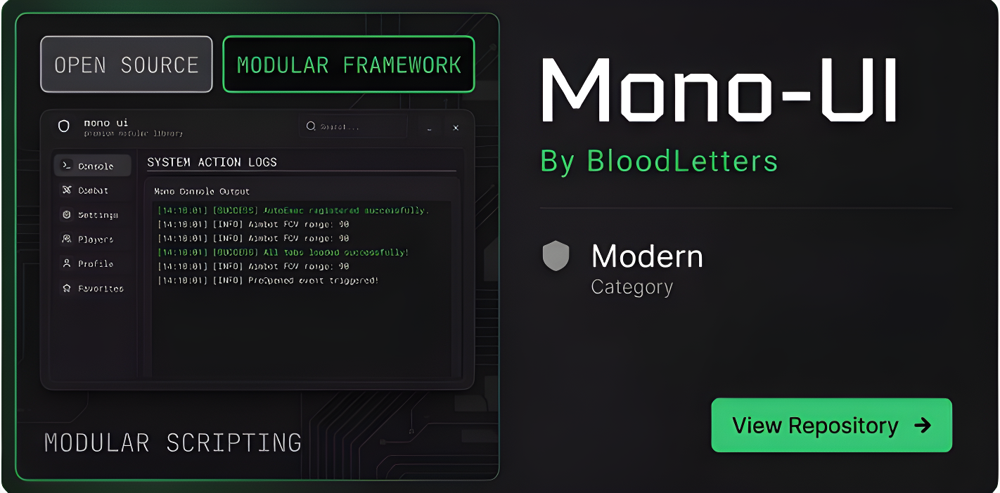

<div align="center">

# 🌌 MonoUI
 <br>
### *Sleek, Modern, and Glassmorphic Dark-Theme UI Library for Roblox*<br>
[](https://github.com/BloodLetters/mono-ui/releases/latest)
[](./LICENSE)
[](https://www.roblox.com)

---
<p align="left">
  <strong>MonoUI</strong> is a high-performance, feature-rich, and highly customizable UI library designed specifically for Roblox script developers. It combines a beautiful glassmorphic dark aesthetic with advanced automation features, built-in state management, and smooth EasingStyle animations.
</p>

</div>

## 🚀 Getting Started

To integrate **MonoUI** into your script, execute the following `loadstring` environment:

```lua
local MonoUI = loadstring(game:HttpGet("[https://github.com/BloodLetters/mono-ui/releases/latest/download/Release.luau](https://github.com/BloodLetters/mono-ui/releases/latest/download/Release.luau)"))()
```

---

## ✨ Key Features

* **🔍 Live Search Bar** – Real-time component filtering across the active tab, matching both titles and flags instantly.
* **🎛️ Draggable Control HUD** – Compact, rounded quick-toggle bar utilizing Lucide icons with smart anti-accidental click dragging.
* **🔄 Auto Teleport Reload** – Persistence engine that automatically re-registers and reloads your scripts upon server hopping or teleportation.
* **📂 Auto Configuration** – Native state serialization that instantly saves/loads complex types (`Color3`, `Enum.KeyCode`, numbers, toggles) to local storage.
* **🔔 Sliding Notifications** – Toast notification stack in the bottom-right corner featuring smooth bounce-back easing animations.
* **🖥️ Watermark Overlay** – Real-time performance HUD showing engine-accurate FPS, Ping, and local clock time.
* **🎯 Skeletal Hitbox Selector** – Interactive advanced skeleton selection system for precise combat/visual configurations.
* **🤖 Built with MCP Support** – Ready-to-use Model Context Protocol implementation to develop scripts seamlessly using your preferred AI models.

---

## 🛠️ Implementation Example

A complete, production-ready demonstration covering all UI components, callbacks, and configuration handling can be found in the repository:

👉 **[View Full Example Script (example.lua)](https://www.google.com/search?q=./example.lua)**

---

## 🔒 License

Distributed under the **MIT License**. You are completely free to fork, modify, distribute, and integrate MonoUI into both personal and commercial scripts.

```

### 💡 Perubahan yang Dilakukan:
1. **Ukuran Banner**: Menggunakan `` di dalam `div align="center"` agar ukuran banner tetap rapi, proporsional, dan tidak memenuhi layar (terlalu besar).
2. **Badges Release & Lisensi**: Ditambahkan *dynamic badges* menggunakan Shields.io yang otomatis mengambil tag rilis terbaru langsung dari repositori GitHub kamu (`BloodLetters/mono-ui`). Warna disesuaikan dengan tema gelap keunguan (`#775ada`).
3. **Tipografi & Struktur**: Tata letak diubah agar lebih *scannable*, menggunakan pembatas horizontal (`---`) untuk memisahkan bagian penting, serta ikon emoji yang lebih terkurasi agar terlihat profesional namun modern.

```