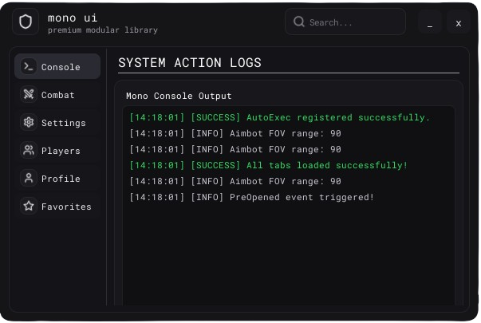

<center>
<h1>MonoUI - Dark Theme Looks UI</h1>
</img>
</center>

**MonoUI** is a modern, and highly customizable UI library for Roblox. It features a sleek glassmorphic dark-theme design, Lucide icon support, smooth animations, auto-configuration saving/loading, automatic script re-execution upon teleportation, and live search filtering.

## 🚀 Getting Started
To load MonoUI, run the following `loadstring`:
```lua
local MonoUI = loadstring(game:HttpGet("https://github.com/BloodLetters/mono-ui/releases/latest/download/Release.luau"))()

```

## ✨ Features
*   **🔍 Live Search Bar**: Real-time filtering of components in the active tab (matches titles & flags).
*   **🎛️ Draggable Control HUD**: Compact rounded quick-toggle bar containing Lucide icons only (supports dragging from individual buttons without accidental clicks).
*   **🔄 Auto Teleport Reload**: Automatically registers and reload scripts when rejoining/switching servers.
*   **📂 Auto Configuration**: Instantly serializes complex states (`Color3`, `Enum.KeyCode`, numbers, etc.) to local storage.
*   **🔔 Sliding Notifications**: Beautiful toast notification cards in the bottom-right corner with EasingStyle bounce-back animations.
*   **🖥️ Watermark Overlay**: Stats HUD showing FPS, Ping (measured in-engine), and local clock time.
*   **🎯 Skeletal Hitbox Selector**: Advanced interactive skeleton selection system
*   **🤖 Build up with MCP**: Use your model to develop your script using our included MCP

## 🛠️ Complete Example Code
You can view the full demonstration implementation by checking the file [example.lua](./example.lua).

## 🔒 License
This library is licensed under the MIT License. Feel free to fork, modify, and integrate into your scripts!
